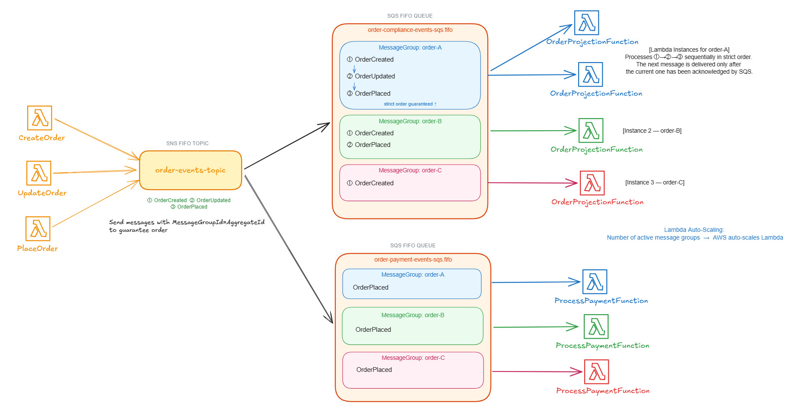
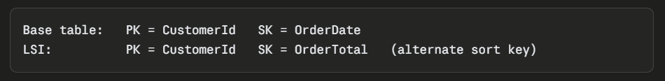
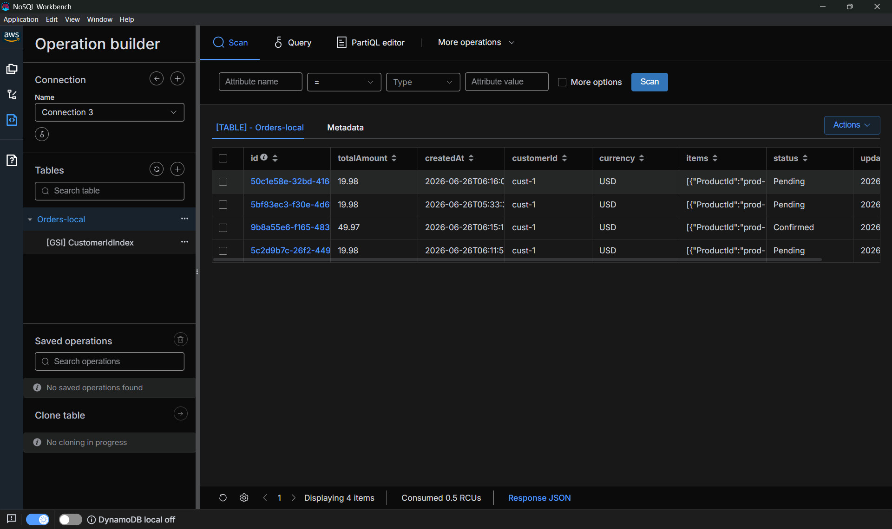

# Vertical Slice Architecture with ASP.NET Core Minimal APIs

## Table of Contents

- [Overview](#overview)
- [Design Strategy](#design-strategy)
- [AWS Services Used](#aws-services-used)
- [SNS-SQS](#sns-sqs)
  - [Pattern: Fan-out via SNS → SQS](#pattern-fan-out-via-sns--sqs)
  - [Standard vs FIFO](#standard-vs-fifo)
  - [Message Ordering with FIFO](#message-ordering-with-fifo)
  - [Consuming from SQS](#consuming-from-sqs)
- [DynamoDB](#dynamodb)
  - [Partition key](#partition-key)
  - [Partition key + Sort key](#partition-key--sort-key)
  - [Global Secondary Index](#global-secondary-index)
  - [Local Secondary Index](#local-secondary-index)
  - [Scan Request](#scan-request)
  - [UI Tool](#ui-tool)
- [Run](#run)
- [References](#references)

## Overview

This repo demonstrates **Vertical Slice Architecture (VSA)**: instead of organizing code into horizontal technical layers (controllers/, services/, repositories/), each business use case ("slice") is a self-contained folder under `Features/` holding everything that use case needs — its command/query, handler, validator, and HTTP endpoint mapping. Slices depend on shared `Domain`/`Infrastructure` building blocks but not on each other.

`Order.Api` and `Payment.Api` are each a single ASP.NET Core **Minimal API** process (Kestrel), one per Bounded Context. This repo was originally built on AWS Lambda (one function per use case, fronted by API Gateway); it has since been lifted onto a normal host to keep the focus on VSA rather than FaaS. DynamoDB (persistence) and SNS/SQS (cross-BC eventing) are retained from that era and are still genuinely useful here — see the [AWS Services](#aws-services-used) and [SNS-SQS](#sns-sqs) sections below.

## Design Strategy

Slices should be grouped by Bounded Context (BC). In general, each BC should be owned by a single team and have its own Git repository.

BC is a self-contained business domain with its own ubiquitous language, domain model, and team ownership. Visit https://github.com/tung-le-lv/OpenMind.DDD.Patterns for more.

In an e-commerce platform, we typically have the following BCs:

```
order/          ← order lifecycle, line items, status
catalog/        ← product listings, inventory levels, pricing
customer/       ← accounts, addresses, loyalty points
payment/        ← charge, refund, payment method management
notification/   ← email, SMS, push notifications
```

**Within a service, one slice per use case.** Each feature folder under `Features/` is a self-registering minimal API endpoint (`IEndpoint` — see `Shared/IEndpoint.cs` / `Shared/EndpointExtensions.cs`): `Program.cs` scans the assembly at startup and calls `MapEndpoint` on every implementation, so adding a new slice never requires touching `Program.cs`.

```
Features/
  CreateOrder/       → CreateOrderEndpoint       POST   /orders
  AddOrderItem/       → AddOrderItemEndpoint      POST   /orders/{id}/items
  UpdateOrderStatus/  → UpdateOrderStatusEndpoint PUT    /orders/{id}/status
  PlaceOrder/         → PlaceOrderEndpoint        POST   /orders/{id}/place
  CancelOrder/        → CancelOrderEndpoint       POST   /orders/{id}/cancel
  DeleteOrder/        → DeleteOrderEndpoint       DELETE /orders/{id}
  GetOrder/           → GetOrderEndpoint          GET    /orders/{id}
  GetAllOrders/       → GetAllOrdersEndpoint      GET    /orders
  GetOrdersByCustomer/            → GetOrdersByCustomerEndpoint            GET /orders/customer/{customerId}
  GetOrdersByCustomerAndStatus/   → GetOrdersByCustomerAndStatusEndpoint   GET /orders/customer/{customerId}/status/{status}
  GetOrdersByDateRange/           → GetOrdersByDateRangeEndpoint           GET /orders/filter?date=YYYY-MM-DD
  HandlePaymentProcessed/         → HandlePaymentProcessedConsumer (BackgroundService, consumes SQS — not an HTTP slice)
```

Note that I made Payment BC part of the same git repo as Order BC for demonstration purpose.

### Not every slice is an HTTP endpoint

`HandlePaymentProcessed` (Order.Api) and `ProcessPayment` (Payment.Api) react to messages on an SQS queue, not HTTP requests. Each is a `BackgroundService` that long-polls its queue and dispatches the same MediatR command a request handler would — it's still a self-contained vertical slice, just with a different trigger. `Payment.Api` has no HTTP-triggered slices at all today, so it runs as a pure background worker.

## AWS Services Used

| Layer | AWS Service | Why it fits |
|---|---|---|
| **Compute** | Kestrel / ASP.NET Core, containerized | Each BC is one normal, always-on web process — no per-route cold starts or execution-role sprawl to manage |
| **Database** | DynamoDB | Scales at the table level; fully managed NoSQL; no connection pool to manage |
| **Async messaging** | SNS/SQS | Fan-out pub/sub between bounded contexts |
| **File storage** | S3 | Object storage |
| **Orchestration** | Step Functions | Coordinates multi-step workflows (e.g. order → payment → fulfillment → notification) with retries, timeouts, and branching. This is actually a Process Manager or Saga Orchestator |

## SNS-SQS

### Pattern: Fan-out via SNS → SQS

```
[Service A] ──publish──▶ [SNS Topic] ──subscribe──▶ [SQS Queue A] ──poll──▶ [BackgroundService A]
                                     └──subscribe──▶ [SQS Queue B] ──poll──▶ [BackgroundService B]
```

### Standard vs FIFO

| | Standard | FIFO |
|---|---|---|
| Message ordering | Not guaranteed | Guaranteed per message group |
| Duplicate delivery | Possible | Deduplicated (5-min window) |

### Message Ordering with FIFO

With a **FIFO** queue:

1. **Publisher** sets `MessageGroupId = AggregateId` on each SNS publish call
2. **SNS FIFO** preserves and propagates `MessageGroupId` to all subscribed SQS FIFO queues
3. **SQS FIFO** enforces strict ordering within each group — no two messages with the same `MessageGroupId` are in-flight simultaneously
4. **The consumer** processes at most **one message per group at a time**, regardless of how many consumer instances are running

Events for aggregate with different IDs (different `MessageGroupId`) are fully parallel.

If a message in group `order-A` fails and is retried, subsequent messages for `order-A` are blocked until the retry resolves. Messages for `order-B`, `order-C`, etc. are unaffected.



See [docs/sns-sqs-ordering.excalidraw](docs/sns-sqs-ordering.excalidraw).

### Consuming from SQS

Each subscribing slice owns a `BackgroundService` (e.g. `HandlePaymentProcessedConsumer`, `ProcessPaymentConsumer`) that long-polls its queue (`ReceiveMessageAsync` with `WaitTimeSeconds = 20`), dispatches the payload through MediatR exactly like an HTTP endpoint would, and deletes the message once handling succeeds — an unhandled exception simply leaves the message on the queue for the next poll (and eventually a DLQ, once one is configured) instead of deleting it. This replaces the old model where Lambda's event-source mapping polled SQS on the function's behalf and auto-scaled the number of concurrent pollers with queue depth; a single always-on consumer is enough for this repo's purposes, but the same pattern scales out by running more instances of the same host.

## DynamoDB

**Table Design**

| `OrderId` | `CustomerId` | `OrderDate` | `LineItems` |
| --- | --- | --- | --- |
| order-001 | cus-001 | 2025-1-1 | [ { "ProductId": "prod-1", "ProductName": "Widget", "Quantity": 2, "UnitPrice": 9.99 }] |
| order-002 | cus-001 | 2025-1-2 | [ { "ProductId": "prod-2", "ProductName": "Widget 2", "Quantity": 1, "UnitPrice": 8 }] |
| order-003 | cus-002 | 2025-1-2 | [ { "ProductId": "prod-1", "ProductName": "Widget", "Quantity": 2, "UnitPrice": 9.99 }] |

### Partition key

`OrderId = PartitionKey`

`OrderId`  is unique across the table → Primary key

Scenario: Query pattern is for retrieving details for single order.

```csharp
return await _dynamoDbClient.GetItemAsync(new GetItemRequest
{
    TableName = "Orders",
    Key = new Dictionary<string, AttributeValue>
    {
        { "OrderId", new AttributeValue { S = orderId } }
    }
});
```

### Partition key + Sort key

On a base table, keys must be unique:

- Partition key only → one item per partition-key value.
- Partition key + sort key → the combination must be unique → one partition-key value can hold multiple items.

`CustomerId` = Partition Key
`OrderDate` = Sort Key
Primary key = `CustomerId + OrderDate`

Scenario:

- Frequently need to get all orders for a single customer.
- Query for a specific order by `CustomerId + OrderDate`.
- This setup means the `CustomerId` partition contains all of that customer's orders in sorted order by `OrderDate`.

Query all orders for customer:

```csharp
var request = new QueryRequest
{
    TableName = "Orders",
    KeyConditionExpression = "CustomerId = :customerId",
    ExpressionAttributeValues = new Dictionary<string, AttributeValue>
    {
        { ":customerId", new AttributeValue { S = "CUST123" } }
    }
};

var response = await _dynamoDbClient.QueryAsync(request);
```

Query exact customer + order:

```csharp
var request = new QueryRequest
{
    TableName = "Orders",
    KeyConditionExpression = "CustomerId = :customerId AND OrderDate = :orderDate",
    ExpressionAttributeValues = new Dictionary<string, AttributeValue>
    {
        { ":customerId", new AttributeValue { S = "CUST001" } },
        { ":orderDate",  new AttributeValue { S = "2024-01-15" } }
    },
    ConsistentRead = true
};

var response = await _dynamoDbClient.QueryAsync(request);
```

### Global Secondary Index

Global Secondary Index (GSI) lets you query by attributes that are not the base table's primary key.

- A GSI is a read-only projection cloned from the base table, kept in sync asynchronously. You write to the base table, never to the GSI directly.
- GSI reads are eventually consistent only.
- GIS read model does not clone all properties from the base table unless you specify them (use **`INCLUDE`).**

```powershell
aws --endpoint-url=http://dynamodb-local:8000 dynamodb create-table -global-secondary-indexes '[{"IndexName":"CustomerIdIndex","KeySchema":[{"AttributeName":"customerId","KeyType":"HASH"}],"Projection":{"ProjectionType":"ALL"}}]'
```

- GSI keys are not required to be unique (neither partition key, sort key, nor the combination).
- GSI can be added or removed at any time after table creation.
- Can create up to 20 GSI per table.
- It requires IndexName (GSI name) in the query request.

Example. Create GSI:

- Partition Key: `OrderDate`
- Sort Key: `OrderId`

The base table uses `OrderId` as its partition key, so "find all orders on a given date" would require a full table `Scan`. Adding a GSI with `OrderDate` as the partition key turns that into an indexed `Query`.

Items are placed into partitions by their partition key (`OrderDate`), so all orders on the same date are co-located automatically. Note that GSI keys are not required to be unique: many orders can share the same `OrderDate`, and the `Query` returns all of them.

The `OrderId` sort key lets you:

- narrow a query to a specific order or a range of `OrderId`s within a date,
- return results in a predictable, sorted order, paginate stably.

```csharp
public async Task<List<Dictionary<string, AttributeValue>>>
    QueryOrdersByDateAsync(DateTime orderDate)
{
    var request = new QueryRequest
    {
        TableName = "Orders",
        IndexName = "OrderDate-OrderId-index",
        KeyConditionExpression = "OrderDate = :pk",
        ExpressionAttributeValues = new Dictionary<string, AttributeValue>
        {
            { ":pk", new AttributeValue { S = orderDate.ToString("yyyy-MM-dd") } }
        }
    };

    return await _dynamoDbClient.QueryAsync(request);
}
```

### Local Secondary Index

Allow query on an alternate sort key, but same partition key as the base table. LSI must be defined when table is created.



Create Local Secondary Index:

- Partition Key: `CustomerId` (same as base table)
- Sort Key: `OrderTotal`

```csharp
// Search cus-001's orders with total between 100 and 500, sorted by OrderTotal descending
var request = new QueryRequest
{
    TableName = "Orders",
    IndexName = "CustomerId-OrderTotal-index", // LSI name
    KeyConditionExpression = "CustomerId = :customerId AND OrderTotal BETWEEN :min AND :max",
    ExpressionAttributeValues = new Dictionary<string, AttributeValue>
    {
        { ":customerId", new AttributeValue { S = "CUST001" } },
        { ":min", new AttributeValue { N = "100" } },
        { ":max", new AttributeValue { N = "500" } }
    },
    ScanIndexForward = false  // largest totals first; omit or set true for ascending
};

var response = await _dynamoDbClient.QueryAsync(request);
```

### Scan Request

Can retrieve any data from table but need to scan the entire table.

```csharp
var request = new ScanRequest
{
    TableName = "Orders",
    FilterExpression = "OrderStatus = :status",
    ExpressionAttributeValues = new Dictionary<string, AttributeValue>
    {
        { ":status", new AttributeValue { S = "Completed" } }
    }
};

return await _dynamoDbClient.ScanAsync(request);
```

—> Better solution is to add a **GSI with `OrderStatus` as the partition key:**

```jsx
var request = new QueryRequest
{
    TableName = "Orders",
    IndexName = "OrderStatus-index",
    KeyConditionExpression = "OrderStatus = :status",
    ExpressionAttributeValues = new Dictionary<string, AttributeValue>
    {
        { ":status", new AttributeValue { S = "Completed" } }
    }
};

return await _dynamoDbClient.QueryAsync(request);
```

### UI Tool
Use [NoSQL Workbench](https://docs.aws.amazon.com/amazondynamodb/latest/developerguide/workbench.html) to browse data locally.

Add a connection: **Operation Builder → Add Connection → DynamoDB Local → hostname `localhost`, port `8000`**.



## Run

**Full local stack** (DynamoDB Local, LocalStack SNS/SQS, both APIs, all wired together):

```
docker compose up --build
```

- `Order.Api` → http://localhost:8081 (see the route table in [Design Strategy](#design-strategy))
- `Payment.Api` → http://localhost:8082 (background worker only, no HTTP routes)

**Debugging a single service** — start its dependencies, then run/debug the project from your IDE (or `dotnet run --project src/Order.Api`) using the `http` launch profile in `Properties/launchSettings.json`:

```
docker compose up dynamodb-local dynamodb-setup localstack localstack-setup
dotnet run --project src/Order.Api
dotnet run --project src/Payment.Api
```

## References
https://github.com/aws-samples  
https://github.com/serverless/examples/tree/master/aws-dotnet-rest-api-with-dynamodb
